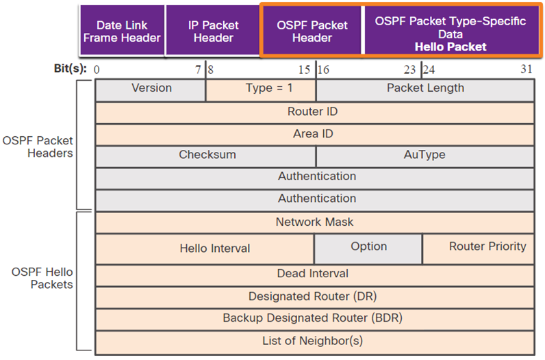

## Introducción a OSPF

Open Shortest Path First
Se usa el algoritmo de Dijkstra

- Es un protocolo de routing de estado de enlace desarrollado como alternativa del protocolo de routing por vector de distancias RIP.

- OSPF tiene ventajas significativas sobre el RIP en el sentido que ofrece una convergencia más rápida y se escala a implementaciones de redes mucho más grandes

- OSPF es un protocolo de routing sin clase que utiliza el concepto de áreas para realizar la escalabilidad. 

- Un administrador de red puede dividir el dominio de enrutamiento en áreas distintas que ayudan a controlar el tráfico de actualización de enrutamiento.

- Un vínculo es una interfaz de un router, un segmento de red que conecta dos routers o una red auxiliar, como una LAN Ethernet conectada a un único router.

- La información acerca del estado de dichos enlaces se conoce como estados de enlace. Toda la información del estado del vínculo incluye el prefijo de red, la longitud del prefijo y el costo.

----
## Componentes OSPF

Los routers que ejecutan OSPF intercambian mensajes para transmitir información de routing por medio de cinco tipos de paquetes.
- Paquetes de saludo
- Paquetes de descripción de la base de datos
- Paquetes de solicitud de estado de enlace
- Paquetes de actualización de estado de enlace
- Paquetes de acuse de recibo de estado de enlace

Los mensajes OSPF se utilizan para crear y mantener tres bases de datos OSPF:

| Base de datos                            | Tabla                 | Descripción                                                                                                                                                                                                                                                                                 |
| ---------------------------------------- | --------------------- | ------------------------------------------------------------------------------------------------------------------------------------------------------------------------------------------------------------------------------------------------------------------------------------------- |
| Base de datos de adyacencia              | Tabla de vecinos      | - Lista de todos los routers vecinos con los que un router estableció comunicación bidireccional.  - Esta tabla es única para cada router.  - Se puede ver con el comando `show ip ospf neighbor.`                                                                              |
| Base de datos de estado de enlace (LSDB) | Tabla de topología    | - Muestra información sobre todos los otros routers en la red.  - Esta base de datos representa la topología de la red.  - Todos los routers dentro de un área tienen LSDB idénticas.  - Se puede ver con el comando `show ip ospf database.`                             |
| Base de datos de reenvío                 | Tabla de enrutamiento | - Lista de rutas generadas cuando se ejecuta un algoritmo en la base de datos de estado de enlace.  - La tabla de routing de cada router es única y contiene información sobre cómo y dónde enviar paquetes para otros routers.  - Se puede ver con el comando `show ip route.` |

Los routers que ejecutan OSPF intercambian mensajes para transmitir información de routing por medio de cinco tipos de paquetes
- Paquetes de saludo.
- Paquetes de descripción de la base de datos.
- Paquetes de solicitud de estado de enlace.
- Paquetes de actualización del estado de enlace.
- Paquetes de acuse de recibo de estado de enlace.

El router arma la tabla de topología; para ello, utiliza los resultados de cálculos realizados a partir del algoritmo SPF (Primero la Ruta más Corta) de Dijkstra. El algoritmo SPF se basa en el costo acumulado para llegar a un destino.

El algoritmo SPF crea un árbol SPF posicionando cada router en la raíz del árbol y calculando la ruta más corta hacia cada nodo. Luego, el árbol SPF se usa para calcular las mejores rutas. OSPF coloca las mejores rutas en la base de datos de reenvío, que se usan para crear la tabla de enrutamiento.

Para mantener la información de enrutamiento, los routers OSPF completan un proceso de enrutamiento de estado de enlace genérico para alcanzar un estado de convergencia. Los siguientes son los pasos de enrutamiento de estado de vínculo que completa un router:

1. Establecimiento de adyacencias de vecinos
2. Intercambio de anuncios de estado de enlace
3. Crear la base de datos de estado de enlace
4. Ejecución del algoritmo SPF
5. Elija la mejor ruta

----
## OSPF área única y multi-área

Para que OSPF sea más eficaz y escalable, este protocolo admite el enrutamiento jerárquico mediante áreas.

Un área OSPF es un grupo de routers que comparten la misma información de estado de enlace en sus LSDB.

El OSPF se puede implementar de una de estas dos maneras:
- OSPF de área única : todos los routers están en un área. La mejor práctica es usar el área 0. 

- Multi-área OSPF -  OSPF se implementa mediante varias áreas, de manera jerárquica. Todas las áreas deben conectarse al área troncal (área 0). Los routers que interconectan las áreas se denominan “routers fronterizos de área” (ABR).

Las opciones de diseño de topología jerárquica con OSPF multi-área pueden ofrecer estas ventajas:

- Tablas de enrutamiento más pequeñas : las tablas son más pequeñas porque hay menos entradas de tabla de enrutamiento. Esto se debe a que las direcciones de red se pueden resumir entre áreas. La sumarización de ruta no está habilitada de manera predeterminada.

- Sobrecarga de actualizaciones de estado de enlace reducida - el diseño de OSPF multi-área con áreas más pequeñas minimiza el procesamiento y los requisitos de memoria.

- Menor frecuencia de cálculos de SPF -– Multi-área OSPF localiza el impacto de un cambio de topología dentro de un área. Por ejemplo, minimiza el impacto de las actualizaciones de routing debido a que la saturación con  se detiene en el límite del área.

----
### OSPF V3

OSPFv3 es el equivalente a OSPFv2 para intercambiar prefijos IPv6.

OSPFv3 intercambia información de routing para completar la tabla de routing de IPv6 con prefijos remotos.

OSPFv3 tiene la misma funcionalidad que OSPFv2, pero utiliza IPv6 como transporte de la capa de red, por lo que se comunica con pares de OSPFv3 y anuncia rutas IPv6. OSPFv3 también utiliza el algoritmo SPF como motor de cómputo para determinar las mejores rutas a lo largo del dominio de enrutamiento.

OSPFv3 tiene procesos diferentes de los de su equivalente de IPv4. Los procesos y las operaciones son básicamente los mismos que en el protocolo de enrutamiento IPv4, pero se ejecutan de forma independiente. 

----
## Tipos de paquetes de OSPF

### 1. Paquete Hello:

>Descubre los vecinos y construye adyacencias entre ellos.

- Se utiliza para establecer y mantener las adyacencias entre routers OSPF.
- Contiene información sobre el router que lo envía, como su ID, las interfaces activas, los temporizadores, etc.
- Permite que los routers vecinos se detecten y establezcan relaciones de adyacencia.

### 2. Paquete Database Description (DBD):

>Controla la sincronización de bases de datos entre routers.

- Se utiliza para intercambiar información sobre la base de datos de estado de enlace (LSDB) entre routers.
- Contiene resúmenes de los registros  que tiene el router que envía el paquete.
- Permite que los routers vecinos sincronicen sus LSDB.

### 3. Paquete Link State Request (LSR):

>Solicita registros específicos de estado de enlace de router a router.

- Se utiliza para solicitar información específica de la LSDB a un router vecino.
- Cuando un router detecta que le falta algún registro , envía un paquete LSR para obtenerlo.

### 4. Paquete Link State Update (LSU):

>Envía los registros de estado de enlace específicamente solicitados.

- Se utiliza para enviar registros  a los routers vecinos.
- Contiene uno o más registros LSA que describen el estado de los enlaces.
- Permite que los routers actualicen su LSDB con la información recibida.

### 5. Paquete Link State Acknowledgment (LSAck):

>Reconoce los demás tipos de paquetes.

- Se utiliza para acusar recibo de la recepción de un paquete LSU.
- Confirma que el router vecino ha recibido correctamente los registros LSA enviados.

----
## Actualizaciones de estados de enlace

- Los paquetes LSU también se usan para reenviar actualizaciones de routing OSPF. 
- Un paquete LSU puede contener 11 tipos de LSA OSPFv2.
- OSPFv3 cambió el nombre de varias de estas LSA y también contiene dos LSA adicionales

- LSU y LSA a menudo se utilizan indistintamente, pero la jerarquía correcta es que los paquetes LSU contienen mensajes LSA.

- El paquete OSPF de tipo 1 es el paquete de saludo. Los paquetes de saludo se utilizan para hacer lo siguiente:

- Descubrir vecinos OSPF y establecer adyacencias de vecinos

- Publicar parámetros en los que dos routers deben acordar convertirse en vecinos

- Elige el router designado (DR) y el router designado de respaldo (BDR) en redes multiacceso, como Ethernet. Los enlaces punto a punto no requieren DR o BDR

---
## Estados de funcionamiento OSPF

Busca realizar lo siguiente:

- Crear adyacencias entre vecinos.
- Intercambiar información de enrutamiento.
- Calcular las mejores rutas.
- Lograr la convergencia.

| Estado     | Descripción                                                                                                                                                                               |
| ---------- | ----------------------------------------------------------------------------------------------------------------------------------------------------------------------------------------- |
| Down State | - Ningún paquete de hello recibido = Down. - El router envía paquetes de hello. - Transición al estado Init.                                                                        |
| Init       | - Se reciben los paquetes de hello del vecino. - Estos contienen el router ID del router emisor. - Transición al estado Two-Way.                                                    |
| Two-Way    | - En este estado, la comunicación entre los dos routers es bidireccional. - En los enlaces de acceso múltiple, los routers eligen una DR y una BDR. - Transición al estado ExStart. |
| ExStart    | En redes punto a punto, los dos routers deciden qué router iniciará el intercambio de paquetes DBD y deciden sobre el número de secuencia de paquetes DBD inicial.                        |
| Exchange   | - Los routers intercambian paquetes DBD. - Si se requiere información adicional del router, entonces realiza la transición a Loading; de lo contrario, la transición al estado Full.   |
| Loading    | - Las LSR y las LSU se usan para obtener información adicional de la ruta. - Las rutas se procesan mediante el algoritmo SPF. - Transición al estado Full.                          |
| Full       | La base de datos des estado de enlace del router está completamente sincronizada.                                                                                                         |

### Establecimiento de adyacencias

Cuando se habilita OSPF en una interfaz, el router envía un paquete *hello* con su ID de router a la dirección multicast 224.0.0.5 para identificar a otros routers OSPF vecinos. 

El ID de router OSPF es un número de 32 bits con formato de dirección IPv4 que identifica de manera única a cada router en el área OSPF.

Cuando un router recibe un paquete *hello* de un router vecino que no está en su lista de vecinos, intenta establecer una adyacencia con ese router.

### Sincronización de bases de datos

Después del estado Two-Way, los routers pasan a los estados de sincronización de bases de datos. Mientras que el paquete de hello se utilizó para establecer adyacencias de vecinos, los otros cuatro tipos de paquetes OSPF se utilizan durante el proceso de intercambio y sincronización de LSDB.

El proceso sigue los siguientes pasos:

>#### Decidir el primer router
>En el estado *ExStart*, los dos routers deciden qué router enviará los paquetes DBD primero. El que tenga la ID de router más alta será el primer router que enviará paquetes DBD durante el estado *Exchange*.

 

>#### Intercambiar DBD
>En el estado *Exchange*, los dos routers intercambian uno o más paquetes DBD. Un paquete DBD incluye información acerca del encabezado de la entrada de LSA que aparece en la LSDB del router.
>Las entradas pueden hacer referencia a un enlace o a una red. Cada encabezado de entrada de LSA incluye información acerca del tipo de estado del enlace, la dirección del router que realiza el anuncio, el costo del enlace y el número de secuencia. El router usa el número de secuencia para determinar qué tan nueva es la información de estado de enlace recibida.

 

>#### Enviar un LSR
>El R1 compara la información recibida con la información que tiene en su propia LSDB. Si el paquete DBD tiene una entrada de estado de enlace más actual, el router pasa al estado *Loading*.

------
## Necesidad de una recuperación ante desastres

Las redes multiacceso pueden crear dos retos para OSPF en relación con la saturación de las LSA

### Creación de varias adyacencias
Las redes Ethernet podrían interconectar potencialmente muchos routers OSPF a través de un enlace común. Crear adyacencias con cada router es innecesario e indeseable. Conduciría a un número excesivo de LSA intercambiados entre los routers de la misma red.

### Saturación con LSA
Los routers de estado de enlace saturan con sus LSA cada vez que se inicializa OSPF o cuando se produce un cambio en la topología. Esta saturación puede llegar a ser excesiva.

Se puede saturar por las distintas razones:

#### Exceso de tráfico de actualización de rutas (LSU)

Cuando hay muchos cambios en la topología de la red, los routers deben enviar numerosos paquetes LSU para actualizar la información de enrutamiento.
Esto puede generar una gran cantidad de tráfico que sature los enlaces.

#### Exceso de tráfico de sincronización de LSDB

Cuando se agrega un nuevo router a la red o se reinicia un router existente, debe sincronizar su base de datos de estado de enlace (LSDB) con sus vecinos.
El intercambio de paquetes DBD y LSR/LSU necesario para esta sincronización puede saturar la red.

#### Exceso de tráfico de paquetes Hello
Si hay demasiados routers en la red, el tráfico de paquetes Hello necesario para mantener las adyacencias puede llegar a saturar los enlaces.

>Para solucionar esos problemas de saturación se recomienda utilizar un *Designated Router* (DR) y un *Backup Designated Router* (BDR)

#### Designación de un DR
- El DR actúa como intermediario en el intercambio de información de enrutamiento.
- Los demás routers envían sus actualizaciones de rutas (LSU) al DR, quien se encarga de distribuirlas a los demás.
- Esto reduce el tráfico de actualización de rutas, ya que solo el DR debe enviar las actualizaciones a todos los routers.

#### Elección del DR

- Los routers OSPF eligen un DR y un BDR de forma automática, basándose en prioridades y en el ID del router.
- Los routers con mayor prioridad y menor ID de router tienen más probabilidades de ser elegidos como DR y BDR.

#### Reducción del tráfico de sincronización:
- Cuando un nuevo router se agrega a la red, solo debe sincronizar su LSDB con el DR y el BDR, en lugar de hacerlo con todos los routers.
- Esto reduce significativamente el tráfico de sincronización de LSDB.

#### Reducción del tráfico de paquetes Hello
- Al tener un DR y un BDR, los demás routers solo envían paquetes Hello a estos, en lugar de a todos los routers de la red.
- Esto disminuye el tráfico de paquetes Hello y ayuda a evitar la saturación de la red.

---
