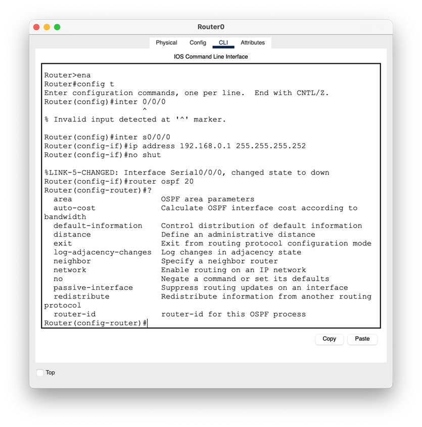
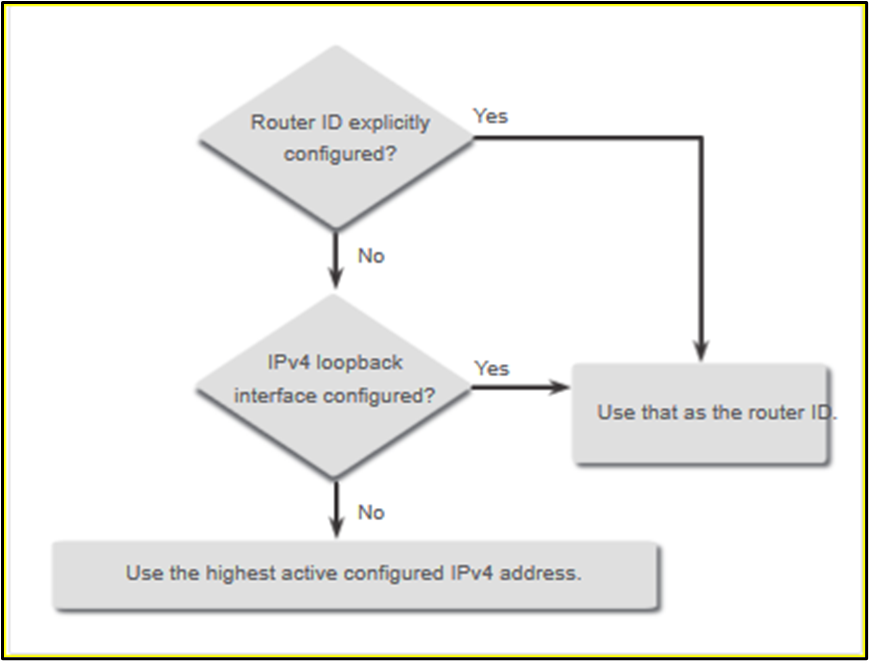
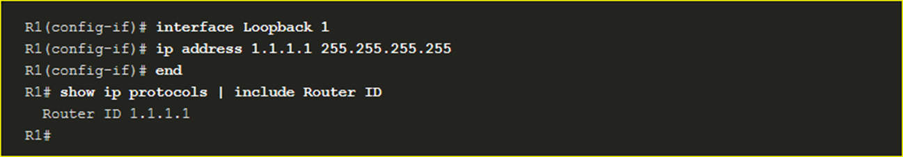
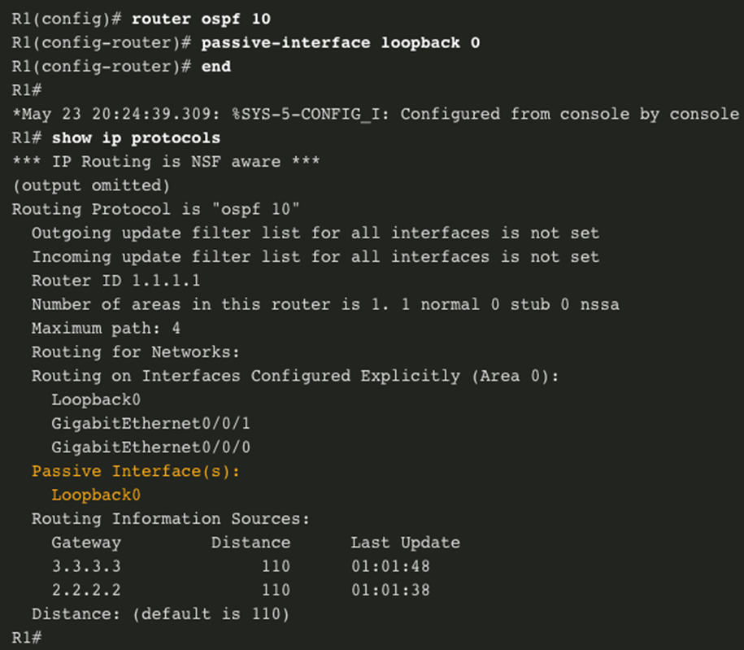
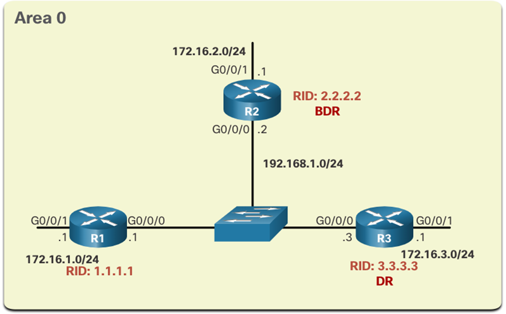
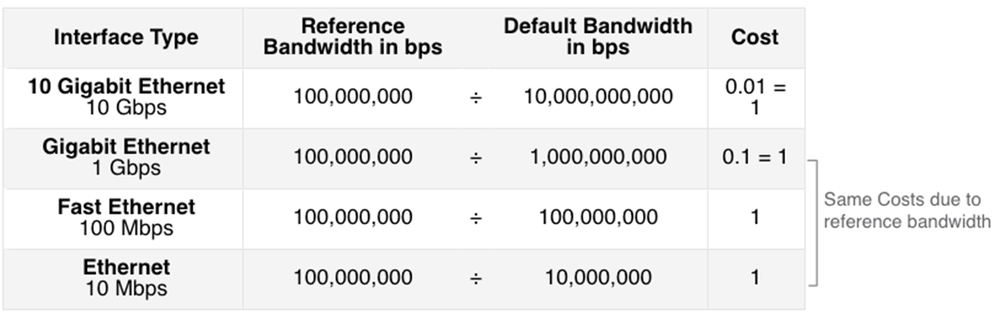

## Router OSPF

OSPFv2 se habilita con el comando `router ospf process-id` del modo de configuración global. `(config#)`

- El valor de `process-id` representa un número entre 1 y 65 535.

- El valor de `process-id` es localmente significativo. 

- Se considera una práctica recomendada utilizar el mismo `process-id` en todos los routers OSPF.

### ID del router OSPF



El router ID de OSPF es un valor de 32 bits, representado como una dirección IPv4. 

Se utiliza para identificar de forma única un router OSPF. 

Para participar en un dominio OSPF, cada router requiere de un router ID.
- Participar en la sincronización de bases de datos OSPF
- Participar en la elección del router designado (DR)

Elección del router id:
- El router ID se configura explícitamente utilizando el comando `router-id «rid»` . Este es el método recomendado para asignar un router ID.
- El router elige la dirección IPv4 más alta de cualquiera de las interfaces de loopback configuradas.
- El router elige la dirección IPv4 activa más alta de cualquiera de sus interfaces físicas.




```bash title="Router OSPF"
R1(config)# router ospf 10 
R1(config-router)# router-id 1.1.1.1 
R1(config-router)# end 
*May 23 19:33:42.689: %SYS-5-CONFIG_I: Configured from console by console 
R1# show ip protocols | include Router ID 
  Router ID 1.1.1.1 
R1#
```



---
## Anuncios de red

Puede especificar las interfaces que pertenecen a una red punto a punto usando el comando `network` . 

También puede configurar OSPF directamente en la interfaz con el comando `ip ospf` .

```bash title="Anuncios red"
Router(config-router)# network network-address wildcard-mask area area-id
```

```bash title="Anuncios red"
R1(config)# router ospf 10 
R1 (config-router) # network 10.10.1.0 0.0.0.255 area 0 
R1(config-router)# network 10.1.1.4 0.0.0.3 area 0
R1 (config-router) # network 10.1.1.12 0.0.0.3 area 0
R1(config-router)#
```

```bash title="Anuncios red"
R1(config)# router ospf 10 
R1 (config-router) # network 10.10.1.1 0.0.0.0 area 0 
R1 (config-router) # network 10.1.1.5 0.0.0.0 area 0 
R1 (config-router) # network 10.1.1.14 0.0.0.0 area 0 
R1(config-router)#c
```

Para configurar OSPF directamente en la interfaz, utilice el comando en modo de configuración `ip ospf interface`. 

```bash title="Sintaxis"
Router(config-if)# ip ospf process-id area area-id
```

```bash title="ip ospf"
R1(config-router)# interface GigabitEthernet 0/0/0 
R1 (config-if) # ip ospf 10 área 0 
R1(config-if)# interface GigabitEthernet 0/0/1 
R1 (config-if) # ip ospf 10 área 0 
R1(config-if)# interface Loopback 0 
R1 (config-if) # ip ospf 10 área 0 
R1(config-if)#
```

De manera predeterminada, los mensajes OSPF se reenvían por todas las interfaces con OSPF habilitado. 

Sin embargo, estos mensajes solo necesitan enviarse por las interfaces que se conectan a otros routers con OSPF habilitado.

El envío de mensajes innecesarios en una LAN afecta la red de tres maneras:
- Uso ineficaz del ancho de banda 
- Uso ineficaz de los recurso
- Mayor riesgo de seguridad

---
## Configurando interfaces pasivas

Utilice el comando `passive-interface` del modo de configuración del router para evitar la transmisión de mensajes de routing a través de una interfaz del router y permitir que se anuncie esa red a otros routers. 

El comando `show ip protocols` se utiliza para verificar que la interfaz Gigabit Ethernet es pasiva.



- Utilice el comando `passive-interface`
- El comando `show ip protocols` se utiliza para verificar la configuración

----
## Redes OSPF punto a punto

```bash title="title"
R1# show ip ospf interface GigabitEthernet 0/0/0
GigabitEthernet0/0/0 is up, line protocol is up 
  Internet Address 10.1.1.5/30, Area 0, Attached via Interface Enable
  Process ID 10, Router ID 1.1.1.1, Network Type BROADCAST, Cost: 1 
  Topology-MTID Cost Disabled Shutdown Topology Name 
        0 1 no no Base 
  Enabled by interface config, including secondary ip addresses 
  Transmit Delay is 1 sec, State BDR, Priority 1 
  Designated Router (ID) 2.2.2.2, Interface address 10.1.1.6 
  Backup Designated router (ID) 1.1.1.1, Interface address 10.1.1.5 
  Timer intervals configured, Hello 10, Dead 40, Wait 40, Retransmit 5 
    oob-resync timeout 40

```


```bash title="title"
R1(config)# interface GigabitEthernet 0/0/0 
R1(config-if)# ip ospf network point-to-point 
*Jun 6 00:44:05.208: %OSPF-5-ADJCHG: Process 10, Nbr 2.2.2.2 on GigabitEthernet0/0/0 from FULL to DOWN, Neighbor Down: Interface down or detached 
*Jun 6 00:44:05.211: %OSPF-5-ADJCHG: Process 10, Nbr 2.2.2.2 on GigabitEthernet0/0/0 from LOADING to FULL, Loading Done 
R1(config-if)# end 
R1# show ip ospf interface GigabitEthernet 0/0/0
GigabitEthernet0/0/0 is up, line protocol is up 
  Internet Address 10.1.1.5/30, Area 0, Attached via Interface Enable
  Process ID 10, Router ID 1.1.1.1, Network Type POINT_TO_POINT, Cost: 1                      
  Topology-MTID Cost Disabled Shutdown Topology Name
```

---
## Redes OSPF multiacceso

- Elige un DR y un BDR. 
- El DR es responsable de recolectar y distribuir los LSA enviados y recibidos. 
- El DR usa la dirección 224.0.0.5 que está destinada a todos los routers OSPF
- Todos los demás routers se convierten en DROTHER. 
- Los DROTHER utilizan la dirección 224.0.0.6 para enviar paquetes OSPF al DR y al BDR. 



Para comprobar las funciones del OSPFv2 , en un router utilice el comando `show ip ospf interface`.

```bash title="show ip ospf interface"
R1# show ip ospf interface GigabitEthernet 0/0/0 
GigabitEthernet0/0/0 is up, line protocol is up
  Internet Address 192.168.1.1/24, Area 0, Attached via Interface Enable 
  Process ID 10, Router ID 1.1.1.1, Network Type BROADCAST, Cost: 1     
  (output omitted) 
  Transmit Delay is 1 sec, State DROTHER, Priority 1 
  Designated Router (ID) 3.3.3.3, Interface address 192.168.1.3 
  Backup Designated router (ID) 2.2.2.2, Interface address 192.168.1.2 
  (output omitted)
  Neighbor Count is 2, Adjacent neighbor count is 2 
  Adjacent with neighbor 2.2.2.2 (Backup Designated Router) 
  Adjacent with neighbor 3.3.3.3 (Designated Router) 
  Suppress hello for 0 neighbor(s) 
R1#
```


```bash title="show ip ospf interface"
R3# show ip ospf interface GigabitEthernet 0/0/0 
GigabitEthernet0/0/0 is up, line protocol is up 
  Internet Address 192.168.1.3/24, Area 0, Attached via Interface Enable
  Process ID 10, Router ID 2.2.2.2, Network Type BROADCAST, Cost: 1 
  (output omitted)
  Transmit Delay is 1 sec, State DR, Priority 1 
  Designated Router (ID) 3.3.3.3, Interface address 192.168.1.3 
  Backup Designated Router (ID) 2.2.2.2, Interface address 192.168.1.2
  (output omitted)
  Neighbor Count is 2, Adjacent neighbor count is 2 
  Adjacent with neighbor 1.1.1.1 
  Adjacent with neighbor 2.2.2.2 (Backup Designated Router) 
  Suppress hello for 0 neighbor(s) 
R3#
```


```bash title="show ip ospf neighbor"
R2# show ip ospf neighbor 
Neighbor ID Pri State Dead Time Address Interface 
1.1.1.1 1 FULL/DROTHER 00:00:31 192.168.1.1 GigabiteThernet0/0/0 
3.3.3.3 1 FULL/DR  00:00:34 192.168.1.3 GigabitEthernet0/0/0
R2#
```
### Estados OSPF que puedes ver en "State"

| **Estado**   | **Significado** |
|-------------|----------------|
| **FULL**    | Adyacencia completa; los routers han intercambiado sus LSDB y están en operación normal. |
| **2WAY**    | Los routers han intercambiado paquetes Hello pero no formaron adyacencia completa (se da en DROTHERs). |
| **EXSTART** | Se inicia el intercambio de bases de datos. |
| **EXCHANGE** | Intercambio de DBDs (Database Description). |
| **LOADING**  | Solicitud y actualización de LSAs. |
| **DOWN**    | No se ha recibido un Hello dentro del tiempo "Dead Time". |


---
## Elección de DR y BDR

La decisión de elección del DR y el BDR OSPF se hace según los siguientes criterios, en orden secuencial.
- Selecciona como DR al router con la prioridad de interfaz más alta. El router con la segunda prioridad de interfaz más alta se elige como BDR

- Si las prioridades de interfaz son iguales, se elige al router con la ID más alta como DR. El router con la segunda ID más alta es el BDR

Una vez que se elige el DR, permanece como tal hasta que se produce una de las siguientes situaciones
- El DR falla
- El proceso OSPF en el DR falla o se detiene
- La interfaz multiacceso en el DR falla o se apaga

Si el DR falla, el BDR se asciende automáticamente a DR..

Después de que un BDR es promovido a DR, se produce una nueva elección de BDR.

<br/>

>Para establecer la prioridad de una interfaz, utilice el comando `ip ospf priority «value»`. Donde `value` es un valor entre  0 a 255
>- Un valor de 0 establece que el router no será DR o BDR
>- Un valor de 1 a 255 en la interfaz establece la posibilidad de que el router se convierta en DR o BDR

<br/>

```bash title="ip ospf priority"
R1(config)# interface GigabitEthernet 0/0/0 
R1(config-if)# ip ospf priority 255 
R1(config-if)# end 
R1#  clear ip ospf process
Reset ALL OSPF processes? [no]: y 
R1# *Jun 5 03:47:41.563: %OSPF-5-ADJCHG: Process 10, Nbr 2.2.2.2 on GigabitEthernet0/0/0 from FULL to DOWN, Neighbor Down: Interface down or detached
```

-----
## Modificando la métrica de costos OSPFv2 de Cisco OSPF de área única

- Un protocolo de ruteo utiliza una métrica para determinar la mejor ruta de un paquete a través de una red. 

- El protocolo OSPF utiliza el costo como métrica. Un costo más bajo indica un mejor camino.

- El costo de Cisco de una interfaz es inversamente proporcional al ancho de banda de la interfaz. Por lo tanto, cuanto mayor es el ancho de banda, menor es el costo. 

- La fórmula que se usa para calcular el costo de OSPF es la siguiente
	- `Costo = ancho de banda de referencia / ancho de banda de la interfaz`

- El ancho de banda de referencia predeterminado es 10^8 (100,000,000); por lo tanto, la fórmula es la siguiente
	- `Costo = 100.000.000 bps/ancho de banda de la interfaz en bps`



----
## Ajuste de ancho de banda de referencia

Para ajustar el ancho de banda de referencia, use el comando de configuración del router: `auto-cost reference-bandwidth «Mbps»`

Otra opción es cambiar el costo en una interfaz específica mediante el comando  `ip ospf cost`.

El costo de una ruta de OSPF es el valor acumulado desde un router hasta la red de destino.

---
## Costo de una ruta


```bash title="Route metric"
R1# show ip route | include 10.10.2.0 
O 10.10.2.0/24 [110/11] via 10.1.1.6, 01:05:02, GigabitEthernet0/0/0 
R1# show ip route 10.10.2.0 
Routing entry for 10.10.2.0/24 
  Known via "ospf 10", distance 110, metric 11, type intra area 
  Last update from 10.1.1.6 on GigabitEthernet0/0/0, 01:05:13 ago 
  Routing Descriptor Blocks: 
  * 10.1.1.6, from 2.2.2.2, 01:05:13 ago, via GigabitEthernet0/0/0 
 	  Route metric is 11, traffic share count is 1 
R1#
```


```bash title="ip ospf cost"
R1 (config) # interfaz g0/0/1 
R1 (config-if) # ip ospf cost 30 
R1 (config-if) # interface lo0 
R1 (config-if) # ip ospf cost 10 
R1 (config-if) # end 
R1#
```

----
## Hello OSPFv2 de área única

Los paquetes Hello OSPFv2 se transmiten a la dirección multicast 224.0.0.5 (todos los routers OSPF) cada 10 segundos. Este es el valor predeterminado del temporizador en redes multiacceso y punto a punto.

<br/>

>Nota
>Los paquetes Hello no se envían en las interfaces configuradas como pasivas mediante el `comando passive-interface`

El intervalo Dead es el período que el router espera para recibir un paquete Hello antes de declarar al vecino como inactivo. Si el intervalo Dead  caduca antes de que los routers reciban un paquete Hello, OSPF elimina ese vecino de su base de datos (LSDB).
El router satura la LSDB con información acerca del vecino inactivo por todas las interfaces con OSPF habilitado. Cisco usa un valor predeterminado de 4 veces el intervalo Hello. Esto es 40 segundos en redes de acceso múltiple y punto a punto.

Los paquetes Hello OSPFv2 se transmiten a la dirección multicast 224.0.0.5 cada 10 segundos.

Este es el valor predeterminado del temporizador en redes multiacceso y punto a punto.

El intervalo Dead es el período que el router espera para recibir un paquete Hello antes de declarar al vecino como inactivo.

Cisco usa un valor predeterminado de 4 veces el intervalo Hello. Esto es 40 segundos en redes de acceso múltiple y punto a punto

Los intervalos Hello y Dead de OSPF pueden configurarse por interfaz.

Los intervalos de OSPF deben coincidir, de lo contrario, no se crea una adyacencia de vecino.


```bash title="Timer intervals"
R1# show ip ospf interface g0/0/0
GigabitEthernet0/0/0 is up, line protocol is up 
  Internet Address 10.1.1.5/30, Area 0, Attached via Interface Enable
  Process ID 10, Router ID 1.1.1.1, Network Type POINT_TO_POINT, Cost: 10
  Topology-MTID Cost Disabled Shutdown Topology Name 
  	    0 10 no no Base 
  Enabled by interface config, including secondary ip addresses 
  Transmit Delay is 1 sec, State POINT_TO_POINT 
  Timer intervals configured, Hello 10, Dead 40, Wait 40, Retransmit 5
    oob-resync timeout 40
(output omitted)
```


```bash title="show ip ospf neighbor"
R1# show ip ospf neighbor 
Neighbor ID Pri State Dead Time  Address Interface 
3.3.3.3 0 FULL/ - 00:00:35 10.1.1.13 GigabitEthernet0/0/1
2.2.2.2 0 FULL/ - 00:00:31 10.1.1.6 GigabitEthernet0/0/0
R1#
```


```bash title="ospf hello/dead-interval"
Router(config-if) # ip ospf hello-interval seconds
Router(config-if)# ip ospf dead-interval seconds
```


----
## Propagación de ruta por deault


```bash title="default-information originate"
R2 (config) # interface lo1 
R2 (config-if) # ip address 64.100.0.1 255.255.255.252 
R2(config-if)# exit 
R2(config)# ip route 0.0.0.0 0.0.0.0 loopback 1 
%Default route without gateway, if not a point-to-point interface, may impact performance 
R2(config)# router ospf 10 
R2(config-router)# default-information originate 
R2(config-router)# end 
R2#
```

----
## Verificación de vecinos OSPF

Comandos utiles de verificación OSPF:
- `show ip interface brief`
- `show ip route`
- `show ip ospf neighbor`
- `show ip protocols`
- `show ip ospf`
- `show ip ospf interface`


```bash title="show ip ospf neighbor"
R1# show ip ospf neighbor 
Neighbor ID Pri State Dead Time  Address Interface 
3.3.3.3 0 FULL/ - 00:00:35 10.1.1.13 GigabitEthernet0/0/1
2.2.2.2 0 FULL/ - 00:00:31 10.1.1.6 GigabitEthernet0/0/0
R1#
```


```bash title="show ip protocols"
R1# show ip protocols 
*** IP Routing is NSF aware *** 
(output omitted) 
Routing Protocol is "ospf 10" 
  Outgoing update filter list for all interfaces is not set 
  Incoming update filter list for all interfaces is not set    
  Router ID 1.1.1.1 
  Number of areas in this router is 1. 1 normal 0 stub 0 nssa 
  Maximum path: 4 
  Routing for Networks: 
  Routing on Interfaces Configured Explicitly (Area 0): 
	Loopback0 
	GigabitEthernet0/0/1 
	GigabitEthernet0/0/0 
  Routing Information Sources: 
	Gateway Distance Last Update 
	3.3.3.3 110 00:09:30 
	2.2.2.2 110 00:09:58 
  Distance: (default is 110) 
R1#
```


```bash title="show ip ospf"
R1# show ip ospf 
Routing Process "ospf 10" with ID 1.1.1.1 
Start time: 00:01:47.390, Time elapsed: 00:12:32.320
 (output omitted)
Cisco NSF helper support enabled 
Reference bandwidth unit is 10000 mbps 
	Area BACKBONE(0) 
		Number of interfaces in this area is 3 
		Area has no authentication 
		SPF algorithm last executed 00:11:31.231 ago 
		SPF algorithm executed 4 times 
		Area ranges are 
		Number of LSA 3. Checksum Sum 0x00E77E 
		Number of opaque link LSA 0. Checksum Sum 0x000000 
		Number of DCbitless LSA 0 Number of indication LSA 0 
		Number of DoNotAge LSA 0 Flood list length 0 
R1#
```


```bash title="show ip ospf interface"
R1# show ip ospf interface GigabitEthernet 0/0/0
GigabitEthernet0/0/0 is up, line protocol is up
  Internet Address 10.1.1.5/30, Area 0, Attached via Interface Enable
  Process ID 10, Router ID 1.1.1.1, Network Type POINT_TO_POINT, Cost: 10 
  
<output omitted>

  Neighbor Count is 1, Adjacent neighbor count is 1 
  	Adjacent with neighbor 2.2.2.2 
  Suppress hello for 0 neighbor(s) 
R1#
```


```bash title="show ip ospf interface brief"
R1# show ip ospf interface brief 
Interface PID Area IP Address/Mask Cost State Nbrs F/C 
Lo0 10 0 10.10.1.1/24 10 P2P 0/0 
Gi0/0/1 10 0 10.1.1.14/30 30 P2P 1/1 
Gi0/0/0 10 0 10.1.1.5/30 10 P2P 1/1 
R1#
```

